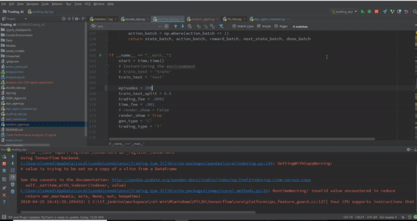
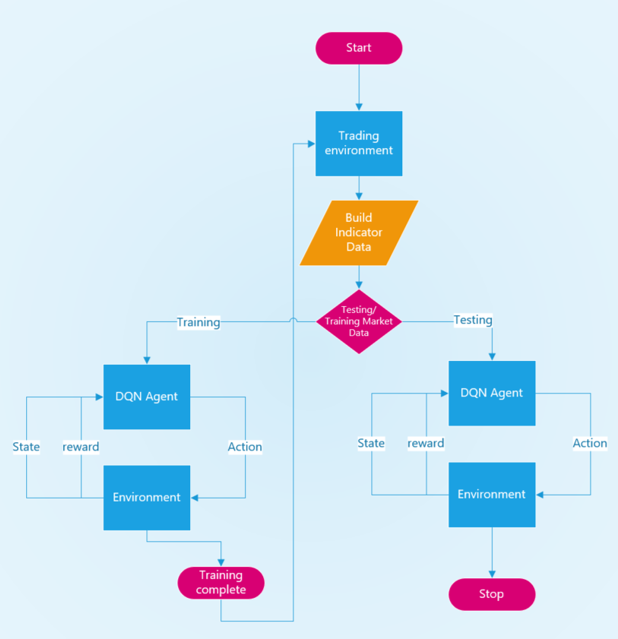
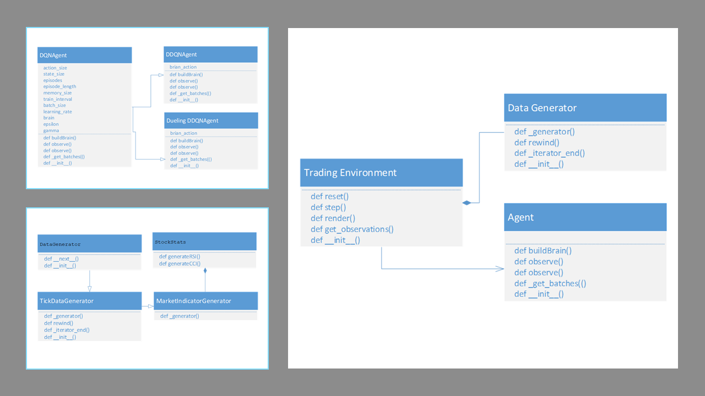

# Deep Reinforcement Learning for Trading 

This repository provides the code for a Reinforcement Learning trading agent with its trading environment that works with both simulated and historical market data. This was inspired by [OpenAI Gym](https://gym.openai.com/) framework. 

This repository has the Keras implementation of
- [Deep Q-Network (DQN)](https://deepmind.com/research/publications/human-level-control-through-deep-reinforcement-learning)
- [Double DQN (DDQN)](https://arxiv.org/abs/1509.06461?source=post_page-----c0de4471f368----------------------)
- [Dueling Double DQN (DDDQN)](https://arxiv.org/abs/1511.06581)

[Code for agents](/Agent/)

[Article about this project](https://www.linkedin.com/pulse/deep-reinforcement-learning-trading-saeed-rahman)

### Requirements
- Python 3.5/3.6
- Keras 
- Tensorflow 

### Workflow

### Architecture

### Features
- 3 Reinforcement learning Agents (DQN, DDQN, DDDQN)
- ADX and RSI technical indicator and extensible for more
- Historical stock market data ingestion through CSV

## Policy
### State
[𝐴𝐷𝑋(𝑡), 𝑅𝑆𝐼(𝑡), 𝐶𝐶𝐼(𝑡), 𝑝𝑜𝑠𝑖𝑡𝑖𝑜𝑛, 𝑢𝑛𝑟𝑒𝑎𝑙𝑖𝑧𝑒𝑑 𝑟𝑒𝑡𝑢𝑟𝑛]
### Action
The agent could take three actions – Buy, Sell or Hold
### Reward
The reward objective is set to maximize realized PnL from a round trip trade. 
It also includes 
- Trading commision (penalty)
- Holding fee (penalty), like the interest brokers charge for overnight levereg position. 
These rewards are what controls and optimize the agents during the training phase that determines the trading behavior.
The latter 2 parameters control the trading frequncy of the agent.

### What's next?
- Prioritized Experience Replay
- LSTM networks
- Asynchronous Advantage Actor-Critic (A3C)
- Multi-agent
- Reward engineering